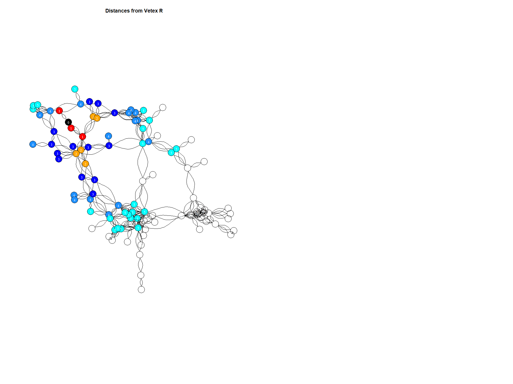
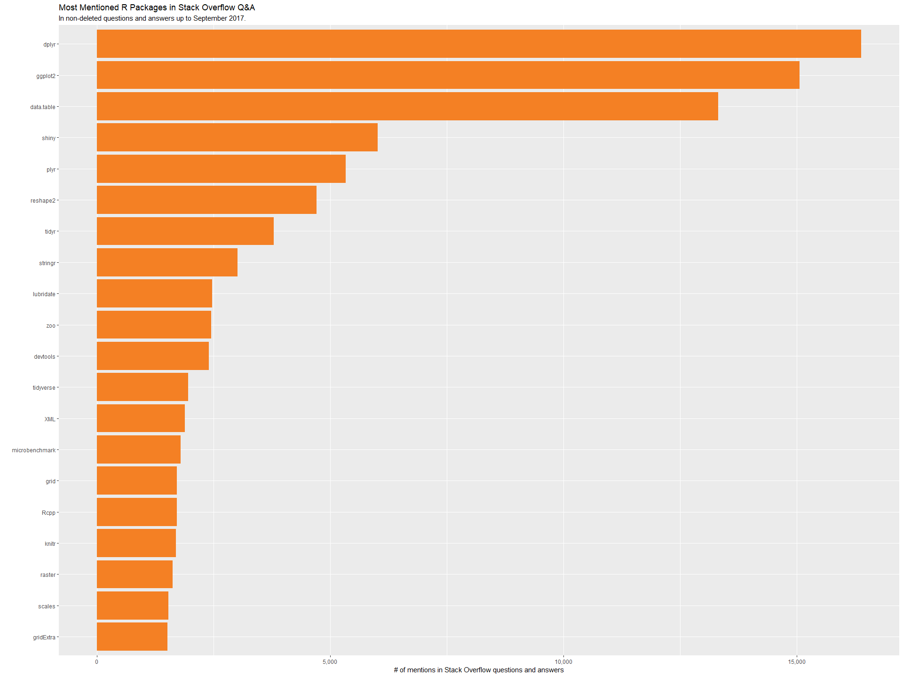

Network Visualization on stack overflow tags
================

Introduction :
==============

This kernel gives the basics of network analysis and various visualization features available with **igraph** package.

``` r
library(ggplot2) 
library(readr) 
library(igraph)
library(ggraph)
library(tidyverse)
library(stringr)
library(scales)
library(lubridate)
library(ggrepel)
library(widyr)

setwd("C:/Users/keert/Documents/Spring 2019 - Sem2/Taken/IDS 564 Social Media/Project/")
```

Reading the source
------------------

2 csv files exists as part of the network, nodes and vertices.

``` r
df_nodes<-read.csv("stack_network_nodes.csv")
str(df_nodes)
```

    ## 'data.frame':    115 obs. of  3 variables:
    ##  $ name    : Factor w/ 115 levels ".net","agile",..: 42 23 41 90 84 85 45 95 43 18 ...
    ##  $ group   : int  6 6 8 8 3 3 4 4 6 1 ...
    ##  $ nodesize: num  272.4 341.2 29.8 52.8 70.1 ...

``` r
df_links<-read.csv("stack_network_links.csv")
str(df_links)
```

    ## 'data.frame':    490 obs. of  3 variables:
    ##  $ source: Factor w/ 115 levels ".net","agile",..: 15 94 13 31 112 56 108 19 96 22 ...
    ##  $ target: Factor w/ 115 levels ".net","agile",..: 1 1 1 1 1 1 1 1 2 3 ...
    ##  $ value : num  20.9 32.3 48.4 24.4 32.4 ...

Converting data to igraph
-------------------------

Converting network data into igraph objects.
**graph.data.frame** function, which takes two data frames: d and vertices.

d describes the edges of the network. Its first two columns are the IDs of the source and the target node for each edge. The following columns are edge attributes (weight, type, label, or anything else). vertices starts with a column of node IDs. Any following columns are interpreted as node attributes.

``` r
set.seed(1234)
g1 <- graph_from_data_frame(d = df_links, vertices = df_nodes, directed = FALSE)
```

Can get the Edges, Vertices,degree and other attributes of graph object with the following the functions.

``` r
## Edges
E(g1)
```

    ## + 490/490 edges from d683461 (vertex names):
    ##  [1] .net               --azure           
    ##  [2] .net               --sql-server      
    ##  [3] asp.net            --.net            
    ##  [4] .net               --entity-framework
    ##  [5] .net               --wpf             
    ##  [6] .net               --linq            
    ##  [7] .net               --wcf             
    ##  [8] c#                 --.net            
    ##  [9] tdd                --agile           
    ## [10] ajax               --codeigniter     
    ## + ... omitted several edges

``` r
## Vetices
V(g1)
```

    ## + 115/115 vertices, named, from d683461:
    ##   [1] html                css                 hibernate          
    ##   [4] spring              ruby                ruby-on-rails      
    ##   [7] ios                 swift               html5              
    ##  [10] c                   c++                 asp.net            
    ##  [13] c#                  objective-c         javascript         
    ##  [16] jquery              redux               reactjs            
    ##  [19] php                 mysql               spring-mvc         
    ##  [22] .net                react-native        spring-boot        
    ##  [25] less                sass                hadoop             
    ##  [28] apache-spark        sql-server          express            
    ## + ... omitted several vertices

``` r
table(head_of(g1, E(g1)))
```

    ## 
    ##   2   4   6   8   9  11  13  14  15  16  18  19  20  21  22  23  24  25 
    ##   2   2   2   2   2   2   2   4   6  10   4  10  10   4   4   4   6   4 
    ##  26  28  29  30  31  32  33  35  37  38  39  40  41  42  43  44  45  47 
    ##  14   2   6   4  10   8   6   2   2   8  10  12  12   2  12   4  10   6 
    ##  48  49  50  51  52  53  54  56  57  58  59  60  61  62  63  64  65  66 
    ##   4   8   2   2  18  12   4   2   4   2   4   8   8   6   8   2  10   2 
    ##  67  68  70  71  72  73  75  76  77  78  79  80  81  82  83  84  85  86 
    ##   2  12   2  12   4   8   2   2   4   4   2   2   2   6   2   2   4   2 
    ##  87  88  89  90  91  92  93  94  95  96  97  98  99 100 101 102 103 104 
    ##   2   4   2   4   2   2   2  12  10   2   2   6   2   6   2   4   4   2 
    ## 105 106 107 108 109 111 112 113 114 115 
    ##  10   2   2   2   4   2   2   2   2   2

``` r
V(g1)$degree<-degree(g1)
gorder(g1)
```

    ## [1] 115

``` r
gsize(g1) # Number of edges in the graph: 490
```

    ## [1] 490

``` r
gorder(g1) # Number of vertices in the graph: 115
```

    ## [1] 115

``` r
reciprocity(g1)  #[1] 1
```

    ## [1] 1

``` r
diameter(g1)    #[1] 10
```

    ## [1] 10

``` r
transitivity(g1)  #[1] 0.4870924 # global clustering: the ratio of the triangles and the connected triples in the graph.
```

    ## [1] 0.4870924

``` r
transitivity(g1, type = "average")  #[1] 0.6154432     #average clustering
```

    ## [1] 0.6154432

``` r
mean(transitivity(g1, type = "local"), na.rm = TRUE)  #[1] 0.09445327  # local clustering
```

    ## [1] 0.09445327

``` r
average.path.length(g1, directed=FALSE, unconnected=TRUE)  #Average Path Length: 4.500097
```

    ## [1] 4.500097

``` r
edge_density(g1)  #Edge Density: 0.0747521
```

    ## [1] 0.0747521

``` r
############## Cliques and Clusters ####################

c1 = transitivity(g1, "local")
d1 = degree(g1)

plot(d1, c1, xlab = "Degree", ylab = "Clustering Coefficient",
     main = "Clustering Coefficient Vs Degree", col = "blue", pch = 16,
     cex = 1)
```


``` r
assortativity_degree(g1, directed = FALSE)  #[1] assortativity degree: 0.1888827
```

    ## [1] 0.1888827

``` r
max(degree(g1))  #[1]Max Degree: 32
```

    ## [1] 32

``` r
#################### centrality measures#######################
# Degree centrality
degree_contact <- degree(g1)
# Node betweenness
betweens_contact <- round(betweenness(g1, v=V(g1), directed = TRUE, nobigint =TRUE, normalized = FALSE))
# Edge betwenness
edgebetweens_contact<-edge.betweenness(g1, e=E(g1), directed = TRUE)
# Local clustering coefficients
clustering_contact <- transitivity(g1, type="local", vids=V(g1))
```

Plotting Networks
-----------------

Plotting the nework object g1, with layout "fr". There exists several layout options will try it later on

``` r
plot(g1,vertex.color="red3",vertex.size=8,edge.arrow.size=0.3,vertex.label.cex=0,vertex.label.dist=0.7)
```


Changing the edges and vertices properties


Removing the vertex and plotting only with the vertices attributes and edges.

``` r
plot(g1, vertex.shape="none", vertex.label=V(g1)$name, 

     vertex.label.font=V(g1)$degree, vertex.label.color="gray40",edge.arrow.size=0.5,directed=TRUE,

     vertex.label.cex=2, edge.color="red",edge.curved=0)
```


Network Layouts
---------------

Network layouts are simply algorithms that return coordinates for each node in a network

### Kamada Kawai

One of the popular force-directed algorithm that produces nice results for connected graphs is Kamada Kawai.
Like Fruchterman Reingold, it attempts to minimize the energy in a spring system.

``` r
plot(g1,vertex.color=rainbow(52),
     vertex.label=V(g1)$name,
     vertex.size=V(g1)$degree,
     vertex.label.cex=1.5,
     vertex.label.color="black",
     edge.arrow.size=0.3,
          layout=layout.kamada.kawai(g1),
     vertex.label.cex=0.7,main="Layout with kamada kawai")
```


### Layout - Fruchterman Reingold

Fruchterman-Reingold is one of the most used force-directed layout algorithms out there.

Force-directed layouts try to get a nice-looking graph where edges are similar in length and cross each other as little as possible.
They simulate the graph as a physical system. Nodes are electrically charged particles that repulse each other when they get too close.
The edges act as springs that attract connected nodes closer together.
As a result, nodes are evenly distributed through the chart area, and the layout is intuitive in that nodes which share more connections are closer to each other.
The disadvantage of these algorithms is that they are rather slow and therefore less often used in graphs larger than ~1000 vertices.

``` r
plot(g1,vertex.color=rainbow(52),
     vertex.label=V(g1)$name,
     vertex.label.cex=1.5,
     vertex.size=V(g1)$degree,
     edge.arrow.size=0.3,
     vertex.label.color="black",
          layout=layout.fruchterman.reingold(g1),
     vertex.label.cex=0.7,main="Layout with Fruchterman Reingold")
```

 \#\#\# Layout Nicely

``` r
plot(g1,vertex.color=rainbow(52),
     vertex.label=V(g1)$name,
     vertex.label.cex=1.5,
     vertex.size=V(g1)$degree,
     edge.arrow.size=0.3,
          layout=layout_nicely(g1),
     vertex.label.cex=0.7,main="Layout Nicely")
```


### Layout - Reingold Tilford


Which vertices has more nodes

``` r
g1_degree<- degree(g1, mode = c("out"))
table(g1_degree)
```

    ## g1_degree
    ##  2  4  6  8 10 12 14 16 18 20 22 24 26 28 32 
    ## 29 17 14 16  6  7  6  6  4  3  1  1  2  2  1

``` r
which.max(g1_degree)
```

    ## jquery 
    ##     16

Community - Betweenness
-----------------------

A number of algorithms aim to detect groups that consist of densely connected nodes with fewer connections across groups.

``` r
g1_bet_community <- betweenness(g1, directed = T)
```

plotting communities
--------------------

``` r
layout <-layout.fruchterman.reingold(g1)
eb <- edge.betweenness.community(g1)
membership <- cut_at(eb, no = 15)
plot(g1,
     vertex.color= rainbow(10, .8, .8, alpha=.8)[membership],vertex.size=10,
     vertex.label=V(g1)$group,vertex.label.cex=1.5,layout=layout,
     edge.arrow.size=.3)
```


### Edge betweenness

High-betweenness edges are removed sequentially (recalculating at each step) and the best partitioning of the network is selected.

``` r
g1_edge_bet <- cluster_edge_betweenness(g1) 
plot(g1_edge_bet, g1) 
```


### Propagating labels

Assigns node labels, randomizes, than replaces each vertex's label with the label that appears most frequently among neighbors.
Those steps are repeated until each vertex has the most common label of its neighbors.

``` r
g1_prop_labels <- cluster_label_prop(g1)
plot(g1_prop_labels, g1)
```

 \#\# Diameter A network diameter is the longest geodesic distance (length of the shortest path between two nodes) in the network.
In igraph, diameter() returns the distance, while get\_diameter() returns the nodes along the first found path of that distance.

Diameter - Plotting for langauge R
----------------------------------

``` r
par(mfrow=c(1,2))
g1_r <- make_ego_graph(g1, diameter(g1), nodes = 'r', mode = c("all"))[[1]]
dist_r <- distances(g1_r, "r")
colors <- c("black", "red", "orange", "blue", "dodgerblue", "cyan")
V(g1_r)$color <- colors[dist_r+1]
plot(g1_r, 
     vertex.label = dist_r, 
     vertex.label.color = "white",
     vertex.label.cex = .8,
     edge.color = 'black',
     vertex.size = 7,
     edge.arrow.size = .05,
     main = " Distances from Vetex R"
)
```



Plotting for language Python
----------------------------

``` r
gpython <- make_ego_graph(g1, diameter(g1), nodes = 'python', mode = c("all"))[[1]]
dists1 <- distances(gpython, "python")
colors <- c("black", "red", "orange", "blue", "dodgerblue", "cyan")
V(gpython)$color <- colors[dists1+1]
plot(gpython, 
     vertex.label = dists1, 
     vertex.label.color = "white",
     vertex.label.cex = .8,
     edge.color = 'black',
     vertex.size = 7,
     edge.arrow.size = .05,
     main = "Distances from Vetex python"
     )
```


Network with ggraph
-------------------

ggraph is an extension of ggplot2 aimed at supporting relational data structures such as networks, graphs, and trees. Let's add the grammar of graphics to the network.

``` r
ggraph(g1,layout = "fr") +
geom_edge_link(aes(width = value), show.legend = FALSE,alpha=0.5) +
geom_node_point(aes(color = factor(group), size = nodesize*30)) +
geom_node_text(aes(label = name), repel = TRUE,size=8) +
theme_void()
```


Detailed analysis of R - packages ecosystem
-------------------------------------------

``` r
questions <- read_csv("Questions.csv")
answers <- read_csv("Answers.csv")
r_posts <- bind_rows(questions, answers) %>%
  mutate(PostType = ifelse(is.na(Title), "Answer", "Question"))
tags <- read_csv("Tags.csv")
```

Generating barplot for the R packages
-------------------------------------

``` r
reg <- "(library|require)\\([\"\']?(.*?)[\"\']?\\)|([\\.a-zA-Z\\d]+)::|he [\"\'\`]?([a-zA-Z\\.\\d]+)[\"\'\`]? package"

r_packages <- r_posts %>%
  mutate(Packages = str_match_all(Body, reg),
         Package = map(Packages, ~ c(.[, 3:5]))) %>%
  select(-Packages, -Body) %>%
  unnest(Package) %>%
  filter(!is.na(Package), !Package %in% c("", "R", "r")) %>%
  mutate(Package = str_replace(Package, "'", "")) %>%
  distinct(Id, Package, .keep_all = TRUE)
```

``` r
r_packages %>%
  count(Package, sort = TRUE) %>%
  head(20) %>%
  mutate(Package = reorder(Package, n)) %>%
  ggplot(aes(Package, n)) +
  geom_col(fill = "#f48024") +
  coord_flip() +
  scale_y_continuous(labels = comma_format()) +
  labs(x = "",
       y = "# of mentions in Stack Overflow questions and answers",
       title = "Most Mentioned R Packages in Stack Overflow Q&A",
       subtitle = "In non-deleted questions and answers up to September 2017.")
```



Most used packages in R; mentioned in stackoverflow in 2017
-----------------------------------------------------------

``` r
year_totals <- r_posts %>%
  semi_join(r_packages, by = "Id") %>%
  count(Year = year(CreationDate)) %>%
  rename(YearTotal = n)

package_by_year <- r_packages %>%
  transmute(Id = coalesce(ParentId, Id), Package, Year = year(CreationDate)) %>%
  distinct(Id, Package, Year) %>%
  count(Package, Year) %>%
  group_by(Package) %>%
  mutate(PackageTotal = sum(n)) %>%
  ungroup() %>%
  inner_join(year_totals, by = "Year")

package_by_year %>%
  filter(PackageTotal >= 1200) %>%
  mutate(Percent = n / YearTotal) %>%
  complete(Package, Year, fill = list(Percent = 0)) %>%
  mutate(Package = reorder(Package, -PackageTotal, mean)) %>%
  ggplot(aes(Year, Percent, color = Package)) +
  geom_line(show.legend = FALSE, size = 1) +
  facet_wrap(~ Package) +
  scale_x_continuous(breaks = seq(2009, 2017, 2)) +
  scale_y_continuous(labels = percent_format()) +
  theme_light() +
  labs(x = "Year",
       y = "% of R questions where either the question or an answer uses package",
       title = "Use of R packages in Stack Overflow Q&A over time",
       subtitle = "For the 20 most-mentioned packages. 2017 includes only Jan-Sep.")
```


``` r
package_growth <- package_by_year %>%
  transmute(Package, PackageTotal, Year = paste0("Y", Year), Percent = n / YearTotal) %>%
  spread(Year, Percent) %>%
  mutate(Average = (Y2016 + Y2017),
         Growth = Y2017 / Y2016)
```

Growth rate of R packages observed in either stackoverflow questions/answers
----------------------------------------------------------------------------

``` r
package_growth %>%
  top_n(100, Average) %>%
  arrange(desc(Growth)) %>%
  filter(Package != "tidyverse") %>%
  ggplot(aes(Average, Growth)) +
  geom_point() +
  geom_text_repel(aes(label = Package), force = .01, nudge_x = .005, nudge_y = .01) +
  scale_x_log10(labels = percent_format()) +
  scale_y_log10(breaks = c(.25, .5, 1, 2, 4), labels = c(".25X", ".5X", "1X", "2X", "4X")) +
  geom_hline(lty = 2, color = "#f48024", yintercept = 1) +
  theme_light() +
  labs(x = "Average % of questions across the two years",
       y = "Year/year growth in % of questions (log scale)",
       title = "Growing/Shrinking R Packages; in Stack Overflow Questions/Answers",
       subtitle = paste("Growth is in what % of questions are either about the package, or have an answer that loads the package, between 2016 and 2017.",
                        "Only the 100 largest packages are shown. The tidyverse package grew 9X and was removed.", sep = "\n"))
```


``` r
options(repr.plot.width = 13, repr.plot.height = 8)
```

Calculating correlation of R- package tags found on the stackoverflow answers on the same question
==================================================================================================

``` r
package_posts <- r_packages %>%
  filter(PostType == "Answer") %>%
  distinct(ParentId, Package) %>%
  add_count(Package) %>%
  filter(n >= 100)

cors_filtered <- package_posts %>%
  pairwise_cor(Package, ParentId, sort = TRUE) %>%
  filter(correlation > .05)

package_counts <- r_packages %>%
  count(Package) %>%
  filter(Package %in% cors_filtered$item1 | Package %in% cors_filtered$item2)

vertices <- package_counts %>%
  inner_join(package_growth, by = "Package")
```

Ecosystem of R packages based on correlation found on the stackoverflow answers on the same question
----------------------------------------------------------------------------------------------------

``` r
suppressPackageStartupMessages(library(igraph))

set.seed(2019)

cors_filtered %>%
  graph_from_data_frame(vertices = vertices) %>%
  ggraph(layout = "fr") +
  geom_edge_link(aes(edge_alpha = correlation), show.legend = FALSE) +
  geom_node_point(aes(size = Y2017 * 1.05), color = "black") +
  geom_node_point(aes(size = Y2017, color = pmin(4, Growth))) +
  scale_size_continuous(range = c(.5, 14), labels = percent_format(),
                        breaks = seq(.05, .2, .05)) +
  geom_node_text(aes(label = name), repel = TRUE, size = 4) +
  theme_void(base_size = 16) +
  scale_color_gradient2(low = "#0077CC", high = "#f48024", trans = "log", breaks = 2 ^ seq(-1, 2),
                        labels = c(".5X", "Same", "2X", "4X")) +
  labs(title = "Ecosystem of R packages",
       subtitle = "Correlations are based on packages often used in Stack Overflow answers on the same question.",
       size = "% of 2017 questions",
       color = "2017/2016 Growth") +
  expand_limits(x = -6)
```


